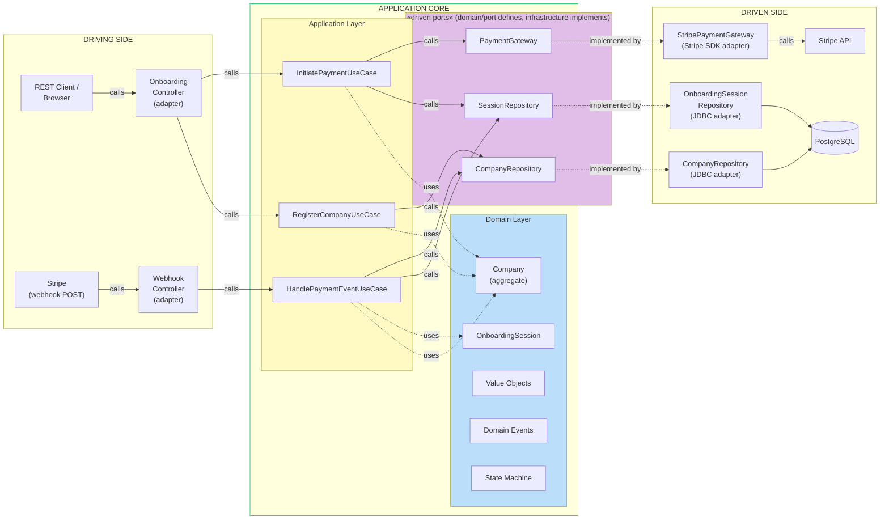
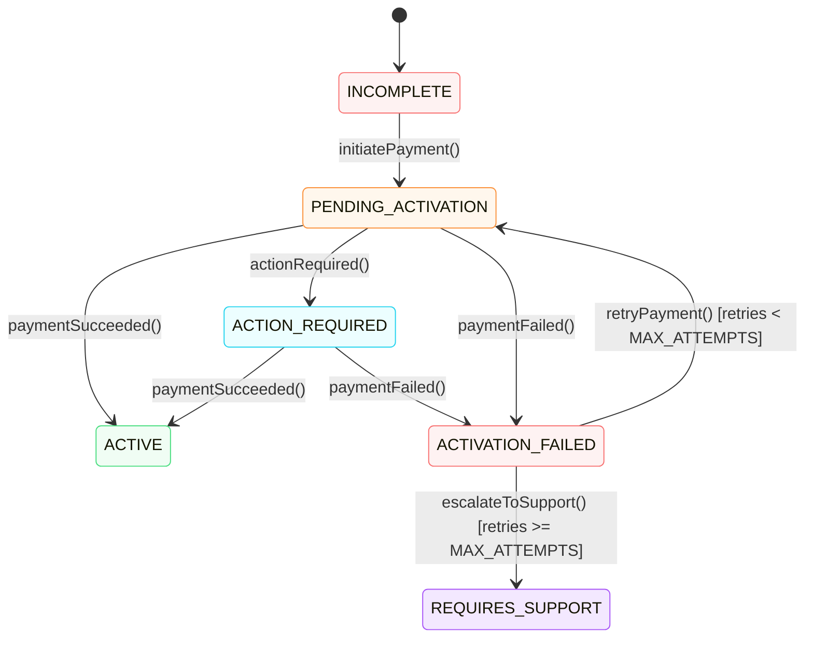

# Design Document

## Problem Statement

> As a company admin, I need to register my company and complete a subscription payment,
> so that my account activates immediately on success, remains accessible while awaiting
> async payment confirmation, and lets me retry a declined payment without having to start over.

---

## Bounded Context

The entire slice lives in the **Onboarding** bounded context. Its single responsibility is to
take a company from "unknown" to "active, paying customer." Payment concepts are wrapped behind
a domain port; the domain model never imports Stripe types directly.

---

## Architecture: Hexagonal (Ports & Adapters)

### Why hexagonal?

The classic layered architecture (Controller → Service → Repository) tends to blur boundaries
over time: services accumulate Stripe SDK calls, JPA annotations creep into domain objects, and
tests become hard to write without a full Spring context. The core problem is that the domain
*depends on* infrastructure, when it should be the other way around.

Hexagonal architecture (also called Ports & Adapters) inverts this.
The domain sits at the centre and defines *interfaces* (ports) for everything it needs. The
outside world — HTTP, Stripe, the database — provides *implementations* (adapters) that plug
into those ports. Nothing in the domain or application layer imports a framework class or an
SDK type.

This matters concretely for this project in three ways:

1. **Stripe can be swapped without touching domain logic.** `PaymentGateway` is a port. Tests
   use a `MockPaymentGateway`; production uses `StripePaymentGateway`. The state machine and
   use cases are identical in both cases.

2. **The domain is testable in plain Java.** State machine tests, aggregate invariant tests,
   and use case tests need no Spring context, no database, and no Stripe account. They run in
   milliseconds.

3. **The delivery mechanism is a detail.** If we later want a queue consumer or a CLI tool to
   trigger onboarding, we add a driving adapter. The use cases stay unchanged.

### Diagram




### Ports explained

A port is just a Java interface. The critical rule is **who writes it and who implements it**.

#### Driven ports — defined inside the core, implemented outside

The domain declares what it needs. Infrastructure delivers it.

```
domain/port/CompanyRepository.java          ← interface, lives in the core
infrastructure/persistence/
    CompanyRepositoryJdbc.java              ← implements CompanyRepository, lives in infra
```

```java
// domain/port/CompanyRepository.java
// Pure Java. No Spring, no SQL, no database concept.
public interface CompanyRepository {
    void save(Company company);
    Optional<Company> findById(CompanyId id);
}

// infrastructure/persistence/CompanyRepositoryJdbc.java
// All the database detail lives here, invisible to the domain.
public class CompanyRepositoryJdbc implements CompanyRepository {
    private final NamedParameterJdbcTemplate jdbc;

    @Override
    public void save(Company company) { /* SQL here */ }

    @Override
    public Optional<Company> findById(CompanyId id) { /* SQL here */ }
}
```

Same pattern for `PaymentGateway`:

```java
// domain/port/PaymentGateway.java  ← the domain's requirement, in plain Java
public interface PaymentGateway {
    CustomerReference createCustomer(ContactInfo contact, CompanyId companyId);
    PaymentIntentResult createPaymentIntent(CustomerReference customer, Money amount, OnboardingSessionId sessionId);
}

// infrastructure/stripe/StripePaymentGateway.java  ← Stripe SDK confined here
public class StripePaymentGateway implements PaymentGateway { ... }
```

The consequence is the dependency arrow always points **inward**:

```
infrastructure/CompanyRepositoryJdbc   →   domain/port/CompanyRepository
infrastructure/StripePaymentGateway    →   domain/port/PaymentGateway
```

If you deleted every file in `infrastructure/`, the domain and application layers
would still compile. Infrastructure needs the domain; the domain needs nothing.

#### Driving ports — called from outside, implemented inside the core

The controllers (adapters on the driving side) call into use cases. Controllers depend on
use cases; use cases do not know controllers exist.

```java
// application/usecase/RegisterCompany.java
@Service
public class RegisterCompany {
    public RegistrationResult execute(String companyName, ContactInfo adminContact) { ... }
}

// infrastructure/web/OnboardingController.java
// The controller depends on the use case — never the other way around.
@RestController
public class OnboardingController {
    private final RegisterCompany registerCompany;
    ...
}
```

**`OnboardingPort` — the REST API contract**

`OnboardingPort` is an interface in `infrastructure.web` that defines the three HTTP handler
signatures. `OnboardingController` is its only implementation. It lives in the web layer
(not the domain) because its method signatures reference DTO and `ResponseEntity` types —
it is an HTTP contract, not a domain abstraction.

The value is documentation and enforceability: the interface makes the API surface explicit,
and `@Override` on each handler makes it immediately clear which methods satisfy the contract.

**Why inbound port interfaces per use case?**

Consistency with the driven side: every boundary is crossed through an interface. The
controller imports only from `domain.port.inbound` — the same way infrastructure imports
only from `domain.port.outbound`. The `@PostMapping` handlers call the use case interfaces
directly; there is no delegation layer.

Each use case exposes exactly one public method — `execute` — so a caller never has to decide which method to invoke, and the use case stays focused on a single operation.

This single-entry-point discipline is additionally enforced by an ArchUnit test:

```java
// Every @Service in the application layer may only have one public method, named execute.
methods().that().areDeclaredInClassesThat()
    .resideInAPackage("..application.usecase..")
    .and().areAnnotatedWith(Service.class)
    .and().arePublic()
    .should().haveName("execute");
```

This makes the convention a failing build rather than a code review comment.

### Package layout

```
com.example.onboarding
├── domain
│   ├── model          (Company, OnboardingSession, value objects)
│   ├── event          (CompanyRegistered, PaymentSucceeded, …)
│   └── port           (PaymentGateway, CompanyRepository, SessionRepository)
├── application
│   └── usecase        (RegisterCompanyUseCase, InitiatePaymentUseCase,
│                        HandlePaymentEventUseCase)
└── infrastructure
    ├── persistence    (JDBC adapters, domain↔row mappers)
    ├── stripe         (StripePaymentGateway, StripeWebhookVerifier)
    └── web            (OnboardingController, WebhookController, request/response DTOs)
```

The dependency rule is strictly enforced: `infrastructure` depends on `application` and
`domain`; `application` depends on `domain`; `domain` depends on nothing.

---

## Domain Model

### Aggregates

**`Company`** — aggregate root. Owns the registration and payment lifecycle. Enforces state
transition invariants by throwing a domain exception on illegal transitions (e.g. calling
`paymentSucceeded()` on an already-active company). Tracks a `retryCount` against a
`MAX_ATTEMPTS` constant — when exhausted, `retryPayment()` throws `MaxRetriesExceededException`
and the use case calls `escalateToSupport()`, transitioning the company to `REQUIRES_SUPPORT`.

**`OnboardingSession`** — separate aggregate, referenced by `CompanyId`. Tracks a single
payment attempt: the Stripe PaymentIntent ID, the client secret returned to the frontend,
and timestamps. Keeping it separate means:
- Payment retry creates a new `OnboardingSession` without mutating `Company` history.
- The payment lifecycle is independently evolvable (future: multiple attempts, audit trail).

The admin's identity is captured as a `ContactInfo` value object (email, first name, last name) directly on `Company` — there is no separate `AdminUser` entity in this slice.

### Value Objects

All primitive values are wrapped in typed value objects — no raw `String` or `UUID` in method
signatures.

| Value Object | Wraps | Why |
|---|---|---|
| `CompanyId` | `UUID` | Prevents passing wrong ID type across use case boundaries |
| `OnboardingSessionId` | `UUID` | Same |
| `CustomerReference` | `String` | Anti-corruption; Stripe internals stay in infrastructure |
| `PaymentIntentId` | `String` | Same |
| `Money` | `long` (minor units) + `Currency` | Prevents float arithmetic errors; makes currency explicit |
| `ContactInfo` | email, firstName, lastName | Groups related fields; validated as a unit |

### Domain Events

Not implemented in this slice. The natural consumer would be a notification service — for example, emailing the company admin if their payment fails, if manual action is required, or if they have exhausted their retry attempts. Without a notification service there is nothing to publish to, so events are out of scope for the MVP.

---

## Company Status State Machine

Transition logic lives as explicit methods on the `Company` aggregate, not in a service.
The aggregate owns the rule "which transitions are valid."


---

## Integration: Stripe

See [STRIPE.md](STRIPE.md) for the full Stripe integration detail: port and adapter design,
response contracts, webhook flow, idempotency keys, async race conditions, and dual-write
tradeoffs.

---

## Regional Pricing

Subscription price and currency are resolved server-side from a `regional_prices` table,
seeded by Flyway. The client supplies `ipCountry` (ISO 3166-1 alpha-2) in the payment
initiation request; the server looks up the matching row and uses that `Money` value when
creating the Stripe PaymentIntent.

If the country code is not found in the table, the use case falls back to the `US` row. When the fallback
is used, a `pricingWarning` is returned in the response so the frontend can surface a message
such as: *"Could not determine pricing for your region. Defaulting to USD."*

A fallback means we are missing a pricing entry for that country. In production, the fallback should fire a tagged metric to Prometheus — e.g. `pricing_fallback_total{country="JP"}` — so Grafana can surface which countries are triggering it and how often. This makes a data gap visible before it becomes a support or revenue problem.

### Why client-supplied `ipCountry` rather than server-side derivation?

| Approach | Pros | Cons |
|---|---|---|
| Client sends `ipCountry` | Simple, no extra infrastructure, easy to test | Client can lie — a user could claim a cheaper region |
| Server derives from request IP | Tamper-proof | Requires a geolocation library (MaxMind, ip-api); VPNs still defeat it |

**Decision for this slice:** client-supplied. The implementation is transparent and easy to
verify. The risk of price manipulation is acceptable here because regional pricing differences
reflect currency conversion rather than significant discount tiers. In a production system
where price differences are material, server-side IP resolution would be the right default,
with the geolocation call isolated behind the `PricingRepository` port so it remains
swappable.

### How should pricing data be managed?

Hardcoding `amountInMinorUnits` and `currency` in `application.yml` treats a business
concern (what to charge) as an operational concern (how to configure the service) — the
wrong abstraction. Several better options exist:

| Option | How price changes happen | Who can do it |
|---|---|---|
| Flyway migration (current) | New `.sql` migration file, PR, deployment | Developer |
| Internal admin API | `PUT /admin/pricing/{countryCode}` writes to DB directly | Ops team |
| Third-party CMS (Contentful, Sanity, etc.) | Edit a content entry in the CMS UI | Product owner, PM — no developer needed |
| Stripe Price objects | Update price in the Stripe dashboard | Anyone with Stripe access |

**Decision for this slice:** Flyway-seeded database table, for simplicity. Price changes still
require a migration and a deployment, which is not ideal — but it correctly separates pricing
data from application config and keeps it versioned and auditable alongside the schema.

In a real product, a CMS or an internal admin API would be the right call: product owners
and PMs can update prices or add new regions without raising a ticket or waiting for a
deployment.

**This is straightforward to evolve** because `PricingRepository` is a port — an interface
defined in the domain with no infrastructure knowledge. Swapping the Flyway-backed
`RegionalPriceJdbcRepository` for a `ContentfulPricingAdapter` or `StripePricingAdapter`
requires no changes to `InitiatePayment` or any domain code. The hexagonal boundary makes
this a one-implementation swap.

---

## Failure Scenarios

| Scenario | System behaviour | User experience |
|---|---|---|
| Stripe API down during payment initiation | `PaymentGateway` throws; use case catches and wraps in a domain exception; controller returns HTTP 503 | "Payment service unavailable, please try again" — Company stays `INCOMPLETE`, nothing is persisted |
| Card declined (synchronous) | `payment_intent.payment_failed` webhook → Company → `ACTIVATION_FAILED` | Error message with decline reason; retry button re-uses same registration |
| 3DS required | Stripe.js handles redirect on the frontend; `payment_intent.requires_action` webhook → Company → `ACTION_REQUIRED` | User is redirected by the browser; no action needed from backend during the wait |
| Webhook arrives twice (Stripe retry) | `processed_stripe_events` lookup returns existing row; handler returns HTTP 200 immediately | No effect on Company status |
| Webhook arrives before session is persisted | Race condition during high load; webhook handler finds no `OnboardingSession` | Returns HTTP 404 — Stripe will retry with backoff. Alternatively: short retry loop in handler (not implemented; called out as a known edge case) |
| Invalid registration data | Bean Validation rejects request at controller; HTTP 400 with field-level errors | Inline form errors |
| Retry limit reached | `retryPayment()` throws `MaxRetriesExceededException`; use case calls `escalateToSupport()`; `MaxRetriesExceeded` event published | "Something went wrong with your payment. Please contact support." — prevents Stripe card hammering and protects risk score |

---

## Scalability

Writing to multiple tables per onboarding flow (`companies`, `onboarding_sessions`, `processed_stripe_events`) is not a concern — these are a single database transaction, completing in milliseconds, with no shared locks between independent company flows. Concurrent registrations do not block each other.

The real pressure points at high volume, and how to address them:

| Bottleneck | Why it matters | Solution |
|---|---|---|
| Database connections | HikariCP defaults to 10 connections; requests queue under load | Tune pool size; add PgBouncer to multiplex app connections into fewer real DB connections |
| Stripe rate limits | Stripe enforces per-key rate limits; high registration volume triggers 429s | Add retry with exponential backoff to `StripePaymentGateway`; queue payment initiations if needed |
| Webhook throughput | Simultaneous payments fire simultaneous webhooks | Service is stateless — scale horizontally; DB-based idempotency guard is correct across all instances with no extra coordination |
| Status polling | Every waiting frontend polling `GET /{sessionId}/status` adds read traffic | Add a read replica for status queries; or replace polling with SSE or WebSocket to push status changes |

**What scales well by design:**
- The service is stateless — horizontal scaling behind a load balancer requires no coordination
- Each company's onboarding flow is fully independent — no cross-company contention
- DB-based idempotency for webhooks works correctly across multiple running instances

---

## Security

### Current posture

All onboarding endpoints are intentionally public in this slice. This is by design, not an
oversight: the user has no prior identity when they arrive — they are registering for the first
time. There is nothing to authenticate against.

| Endpoint | Auth | Reason |
|---|---|---|
| `POST /api/v1/onboarding/companies/register` | None | User does not exist yet |
| `POST /api/v1/onboarding/{sessionId}/payments` | None (sessionId is unguessable) | No identity established yet |
| `GET /api/v1/onboarding/{sessionId}/status` | None (sessionId is unguessable) | Same |
| `POST /webhooks/stripe` | Stripe signature verification | Handled by `Stripe-Signature` header, not user auth |

The `sessionId` is a UUID v4, which provides implicit protection against enumeration — but it
is not a substitute for real authentication.

### When the auth slice is implemented

Once identity is a first-class concern, the following endpoints must be protected:

- `POST /api/v1/onboarding/{sessionId}/payments` — should require a bearer token proving the caller
  is the admin who initiated this registration
- `GET /api/v1/onboarding/{sessionId}/status` — same

The recommended approach is a JWT issued by a dedicated identity service (or Auth0/Okta) once
the admin's email is verified after registration. Spring Security's OAuth2 resource server can
validate it with minimal config. Auth belongs to a separate bounded context and should not be
owned by the onboarding service.

---

## Scope Decisions

### Built

- Domain model: `Company`, `OnboardingSession`, value objects, state machine
- Use cases: `RegisterCompanyUseCase`, `InitiatePaymentUseCase`, `HandlePaymentEventUseCase`, `RetryPaymentUseCase`, `GetOnboardingStatusUseCase`
- Stripe adapter: customer creation, PaymentIntent creation, webhook event construction
- Webhook handler: signature verification, idempotency via `processed_stripe_events` table
- REST API: register, initiate payment, poll status, webhook receiver
- Flyway schema migrations
- Unit tests: state machine transitions, webhook idempotency

### Described but not built

| Omission | Reason | What production would need |
|---|---|---|
| Frontend / Stripe.js | Out of scope for backend slice | React or plain JS with `@stripe/stripe-js` confirming the PaymentIntent |
| Auth / JWT | Out of scope for MVP. The payment and status endpoints need bearer token protection once built. See Security section. | JWT issued by a dedicated identity service; Spring Security OAuth2 resource server to validate on payment and status endpoints |
| Rate limiting | Ops concern | Bucket4j or API gateway |
| Payment retry UX | Backend fully implemented (`RetryPaymentUseCase`, `POST /{sessionId}/payments/retry`); frontend integration not built | Frontend retries by calling the retry endpoint with the new `sessionId` and confirming the new PaymentIntent via Stripe.js |

---

## Key Tradeoffs

| Decision | Chosen | Alternative           | Why |
|---|---|-----------------------|---|
| `OnboardingSession` as separate aggregate | Yes | Entity inside Company | Independent evolvability; retry creates new session without mutating Company history |
| Hexagonal architecture | Yes | Classic layered       | Domain has zero framework deps; easier to test; aligns with DDD |
| Typed value objects | Yes | Raw `String`/`UUID`   | Compile-time safety across use case boundaries |
| Idempotency via DB table | Yes | In-memory set | Survives restarts; correct under concurrent webhook delivery |
| Stripe real test mode | Yes | Fake/stub `PaymentGateway` implementation | Demonstrates real contract understanding; webhook signature verification is non-trivial |

---

## AI Usage

Claude was used throughout the build as a collaborative design partner — generating architecture plans, writing code, and drafting documentation.

### How AI was used

- **Architecture and design:** Planning the hexagonal structure, aggregate boundaries, port/adapter naming, and state machine before writing any code. AI produced initial proposals; each was discussed, challenged, and often revised.
- **Code generation:** Implementing the domain model, use cases, JDBC repositories, Stripe adapter, webhook handler, and tests. AI generated first drafts; each was reviewed and refined before being accepted.
- **Documentation:** Drafting DESIGN.md, STRIPE.md, and supporting docs. AI wrote initial versions; accuracy of architectural claims was verified against the actual code.

### Where AI output required verification

**1. Test database — H2 vs PostgreSQL**

AI initially scaffolded integration tests using an H2 in-memory database. On review, this was identified as a risk: H2 and PostgreSQL have different SQL dialects, type handling, and function support — tests passing on H2 can mask failures that only appear in production. All JDBC repository tests were replaced with Testcontainers running a real `postgres:16-alpine` container. Had this gone unverified, the test suite would have provided false confidence while hiding real compatibility issues.

**2. Domain naming — status enum leaked payment concepts**

AI named the `Company` status states `PENDING_PAYMENT` and `PAYMENT_FAILED`. These leak the payment mechanism into the company lifecycle — a domain model should not describe its own state in terms of a specific integration. Renamed to `PENDING_ACTIVATION` and `ACTIVATION_FAILED`, which describe what is happening to the *company*, not what Stripe returned.

**3. Price field naming — `amountInCents` is currency-specific**

AI generated `amountInCents` for the `Money` value object. This is incorrect: "cents" is not the minor unit of every currency — JPY has no minor unit, KWD uses three decimal places. The correct ISO 4217 term is `amountInMinorUnits`. Accepting this without checking would have baked an inaccurate assumption into the domain model.

**4. REST endpoint design — initial paths were not RESTful**

AI initially proposed unversioned, action-oriented paths (`/api/onboarding/register`, `/api/onboarding/{sessionId}/retry`). After discussion these were revised to resource-oriented, versioned paths (`/api/v1/onboarding/companies/register`, `/api/v1/onboarding/{sessionId}/payments/retry`). The versioning adds a clear upgrade path; the resource-oriented naming aligns with REST conventions and makes the API surface easier to reason about.
